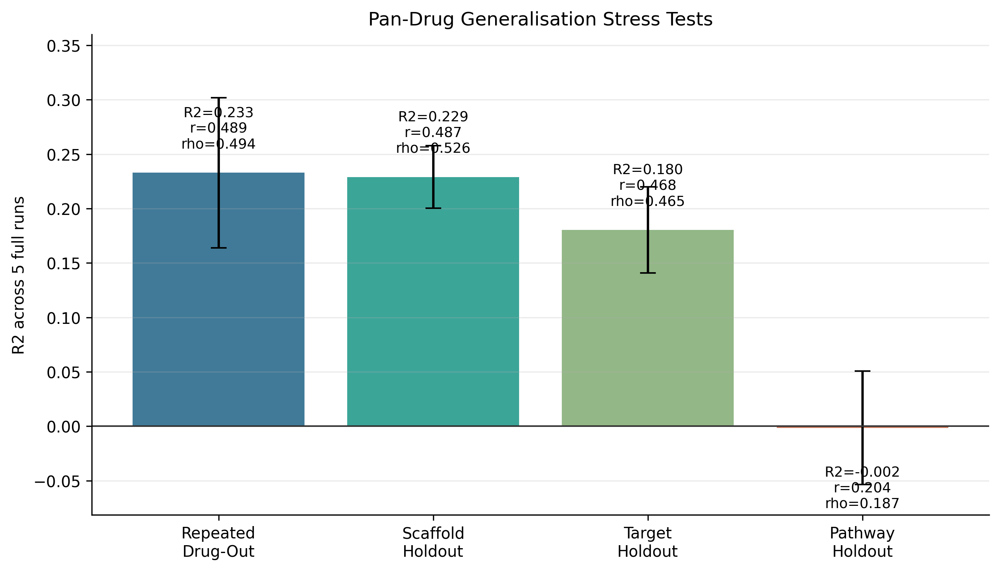
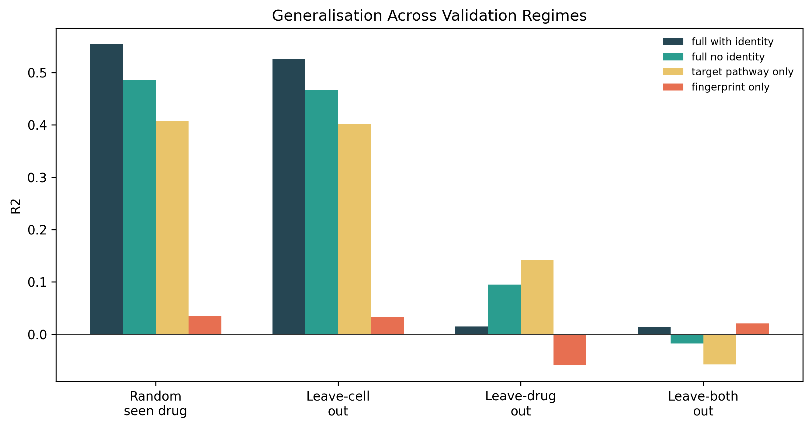
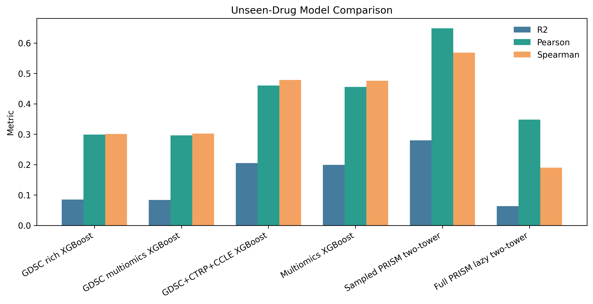
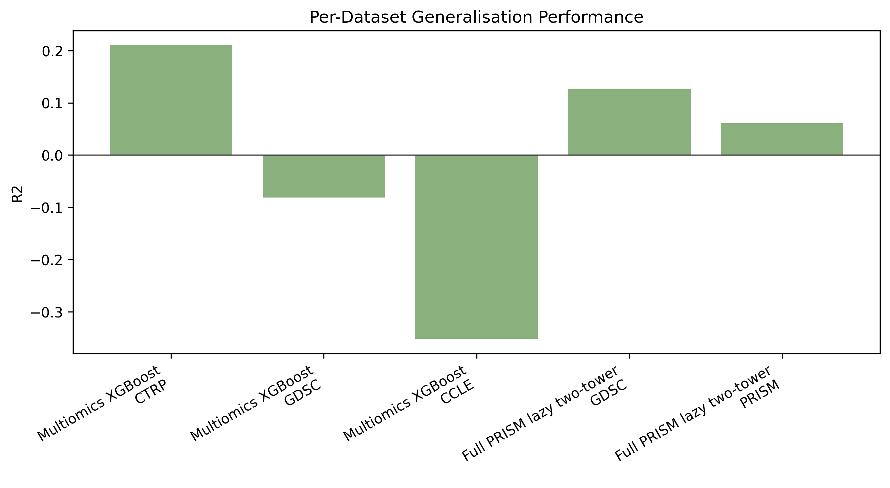
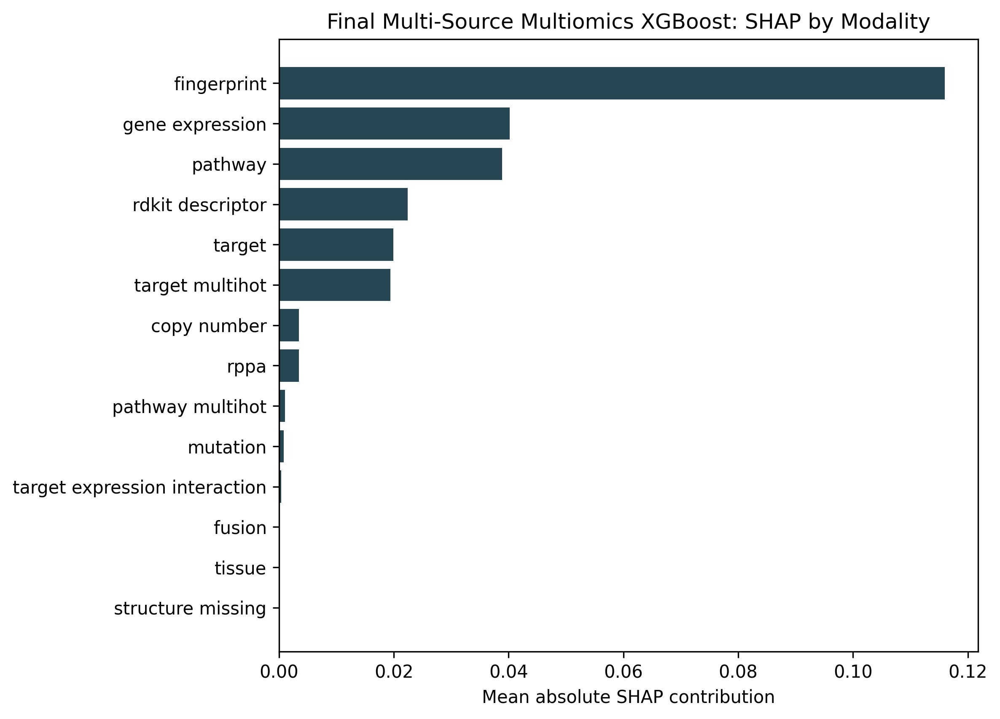
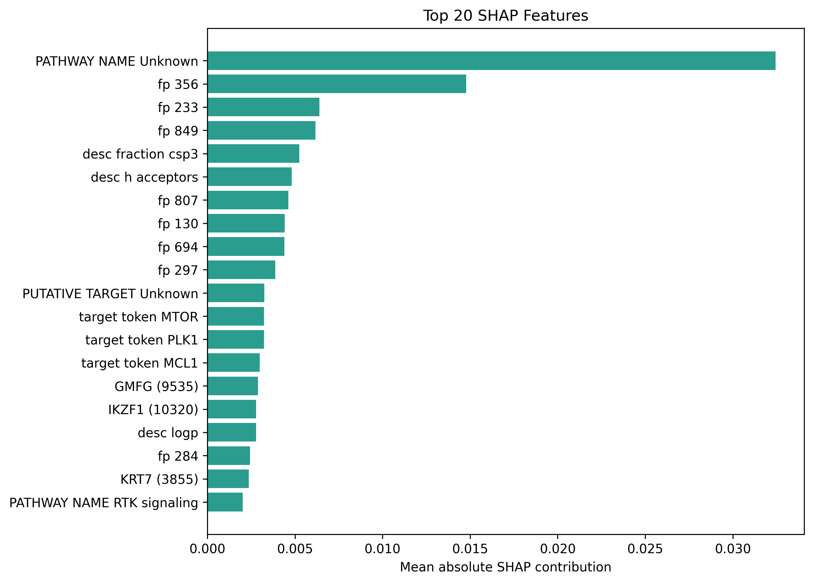
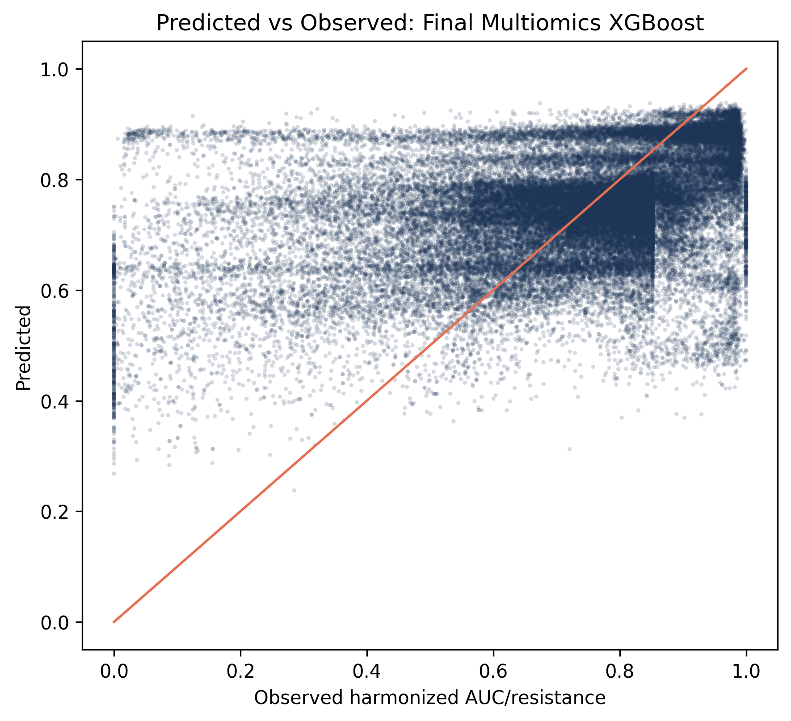

# Results

This document summarises the current validated results for the pan-drug anticancer drug sensitivity prediction framework. The focus is on inductive generalisation, because random drug-stratified splits can overestimate performance when the same drugs appear in both training and testing.

## Result Files

Primary CSV/JSON outputs:

| Artifact | Description |
|---|---|
| [aggregate.csv](../analysis_results/pan_drug_generalization_full/aggregate.csv) | Mean and SD across the 20 pan-drug stress-test runs |
| [runs.csv](../analysis_results/pan_drug_generalization_full/runs.csv) | Per-run metrics and bootstrap confidence intervals |
| [per_dataset.csv](../analysis_results/pan_drug_generalization_full/per_dataset.csv) | Per-source metrics for GDSC, CTRPv2, and CCLE |
| [summary.json](../analysis_results/pan_drug_generalization_full/summary.json) | Full stress-test metadata and metric summary |
| [manuscript_figures](../analysis_results/manuscript_figures) | PNG/SVG figures used in the README and manuscript |

## Dataset Scope

The final XGBoost model uses harmonised GDSC, CTRPv2, and CCLE response data.

| Component | Details |
|---|---|
| Response pool | 689,461 harmonised drug-cell observations |
| Drugs | 901 total compounds in the multi-source pool |
| Cell lines | 984 harmonised cell lines |
| Primary sources | GDSC, CTRPv2, CCLE |
| Additional PRISM use | PRISM was used for the lazy PyTorch two-tower experiment, not as the final XGBoost source |

Cell-line features include expression, mutation, copy-number, fusion, RPPA/proteomic features, and tissue annotations. Drug features include target/pathway annotations, mechanism tokens, Morgan fingerprints, RDKit descriptors, and a structure-missing flag. Drug identity is excluded from the final inductive model.

## Pan-Drug Generalisation Stress Test

The strongest validation is the full 20-model pan-drug generalisation run. Each regime was repeated five times with different grouped holdouts.



| Regime | Runs | Mean R2 | R2 SD | R2 min | R2 max | Mean Pearson | Mean Spearman | Interpretation |
|---|---:|---:|---:|---:|---:|---:|---:|---|
| Repeated leave-drug-out | 5 | 0.233 | 0.069 | 0.144 | 0.328 | 0.489 | 0.494 | Supports unseen-drug transfer |
| Scaffold holdout | 5 | 0.229 | 0.029 | 0.183 | 0.256 | 0.487 | 0.526 | Supports transfer to unseen chemical scaffolds |
| Target holdout | 5 | 0.180 | 0.040 | 0.125 | 0.221 | 0.468 | 0.465 | Supports transfer to unseen target groups |
| Pathway holdout | 5 | -0.002 | 0.052 | -0.051 | 0.079 | 0.204 | 0.187 | Weak transfer to unseen pathway classes |

Interpretation:

- The model demonstrates meaningful pan-drug generalisation to unseen drugs, unseen chemical scaffolds, and unseen target groups.
- Pathway-level generalisation remains weak, so the model should not be described as proven for entirely unseen mechanism classes.
- The strongest wording is: "pan-drug generalisation is rigorously stress-tested and supported under multiple unseen-drug regimes, with clear limits for pathway-level novelty."

## Strict Split Context

Earlier strict split experiments showed why random splits are not enough.

| Setting | R2 | RMSE | Pearson | Spearman | Interpretation |
|---|---:|---:|---:|---:|---|
| Stratified random, full with identity | 0.554 | 0.128 | 0.761 | 0.697 | Interpolation upper bound |
| Stratified random, no identity | 0.486 | 0.137 | 0.709 | 0.677 | Strong known-drug interpolation |
| Drug identity only | 0.448 | 0.142 | 0.687 | 0.700 | Confirms memorisation risk |
| Leave-cell-line-out, no identity | 0.467 | 0.141 | 0.695 | 0.650 | Good unseen-cell transfer |
| GDSC-only leave-drug-out, no identity | 0.095 | 0.192 | 0.348 | 0.293 | Unseen drugs are harder |
| Multi-source multi-omics leave-drug-out | 0.199 | 0.189 | 0.455 | 0.476 | Improved unseen-drug transfer |
| Leave-both-out stress test | ~0.021 | 0.181 | 0.157 | 0.174 | Fully inductive drug-cell transfer remains weak |





## Per-Source Performance

The multi-source model improves pooled generalisation, but source-specific calibration remains imperfect.



From the pan-drug stress-test per-source CSV:

| Regime | Source pattern | Interpretation |
|---|---|---|
| Repeated drug-out | CTRPv2 has the strongest positive R2; GDSC and CCLE show weaker calibration | Pooled model learns rank signal but source scaling differs |
| Scaffold holdout | CTRPv2 and GDSC retain positive signal; CCLE has rank signal but weaker R2 | Scaffold transfer is the most stable drug-novelty result |
| Target holdout | CTRPv2 remains positive; CCLE ranking is stronger than its R2 | Target transfer is meaningful but still source-sensitive |
| Pathway holdout | Weak across sources | Entirely unseen pathway classes need stronger mechanism representations |

## Explainability

True XGBoost TreeSHAP was used instead of pseudo-SHAP. Each prediction is decomposed as:

```text
y_hat_i = phi_0 + sum_k phi_ik
```

where `phi_0` is the expected model output and `phi_ik` is the TreeSHAP contribution of feature `k` for sample `i`.



Final multi-source multi-omics SHAP modality ranking:

| Modality | Mean absolute SHAP |
|---|---:|
| Fingerprint | 0.1160 |
| Gene expression | 0.0402 |
| Pathway | 0.0389 |
| RDKit descriptor | 0.0224 |
| Target | 0.0199 |
| Target multi-hot | 0.0194 |
| Copy-number | 0.0035 |
| RPPA | 0.0034 |
| Mutation | 0.0009 |
| Fusion | 0.0001 |

Top individual features include pathway/target unknown indicators, fingerprint bits, RDKit descriptors, target tokens such as MTOR, PLK1, and MCL1, and gene-expression features such as GMFG, IKZF1, and KRT7.



## Prediction Behaviour



The model shows useful ranking signal for unseen-drug prioritisation, but absolute calibration varies by source. This is why Pearson and Spearman correlations are reported alongside R2, RMSE, and MAE.

## Supplementary Neural Interaction Model

A PyTorch two-tower drug-cell interaction model was implemented with a lazy indexed Dataset. It stores unique cell features and unique drug features once, then streams interaction indices rather than materialising a full dense interaction matrix.

The full PRISM + GDSC lazy run was feasible on CUDA:

| Model | Data | R2 | RMSE | Pearson | Spearman | Interpretation |
|---|---|---:|---:|---:|---:|---|
| Lazy two-tower | Full PRISM + GDSC | 0.063 | 0.152 | 0.348 | 0.190 | Feasible, but not final model |

The neural model is therefore reported as a scaffold for future work, while the primary validated model remains XGBoost.

